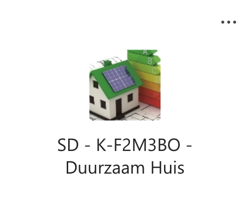

## Les2A

Het HTTP request wordt met ```<form action = "myApi.php">``` gedaan, de ingevoerde tekst komt rechtstreeks uit het Input veld.
```
    <form  action = "myApi.php" method = "GET" class="myForm">
        <fieldset>
            <legend>Data verzenden met HTTP GET protocol</legend>
            <label>Data</label>
            <input type = "text" name = "data" >
            <input type = "submit" value = "Submit GET ">
            
       </fieldset>
    </form>
    
 ```   
 
 [demo](https://schw.hosts1.ma-cloud.nl/iot/les2A/testMyApi.html) https://schw.hosts1.ma-cloud.nl/iot/les2A/testMyApi.html
 
 
# Opdracht
1. Kopieer de code (clone of download)
2. Test de code via jouw local webserver MAMP of XAMPP
3. Bedenk code voor ``` case "easter egg": ```
4. Bedenk code voor ``` case "bedenk zelf een code": ```
5. Test jouw php script
6. Upload jouw code naar GIT en Ma-cloud.  Zet in het README.md bestand de link naar Ma-cloud
7. Lever de link naar GIT in
   
    
```
if (!empty($_GET['data'])){  
            $dataFromGet= $_GET['data'];
            print "<h4>GET request ontvangen</h4>";
            print "de data uit het GET request is: " . $dataFromGet;
            switch($dataFromGet){
                case "server":
                        print "<pre>my server variables are:  " ;
                        print_r($_SERVER);  // show server data
                        print "</pre>"; 
                    break;
                case "tijd":
                        print "<br>server tijd: " . date("h:i:s",$myTime);
                    break;

                 // hier moet jij zelf code schrijven
                    
                case "easter egg":
                    print " <br> hier moet jij zelf code schrijven";
                    break;
                case "bedenk zelf een code":
                    // jouw code hier
                    break;
                  // einde eigen code  
                default:
                    print "<h3>please read the manual for valid requests &#128540;</h3>";
            }
        }  
 ```
