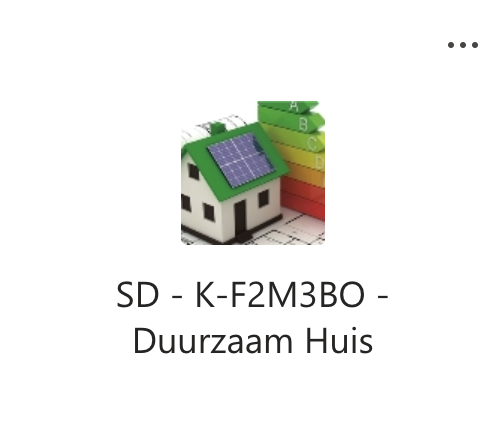

## Les2B

Het HTTP request wordt met Javascript Ajax gedaan ```function makeAjaxCall(url, methodType)``` gedaan, de ingevoerde tekst wordt met JS uit het Input veld gehaald. Het HTML Form heeft geen action meer ```<form class="myForm">```

[demo](https://schw.hosts1.ma-cloud.nl/iot/les2B/testMyApiAjax.html) https://schw.hosts1.ma-cloud.nl/iot/les2B/testMyApiAjax.html

### het HTML form
```
    <form class="myForm">
        <fieldset>
            <legend>Data verzenden met HTTP GET protocol</legend>
            <label>Data</label>
            <input type = "text" name = "data" id="myTextInput">
            <input type = "button" id = "myButton" value = "Submit HTTP GET AJAX ">
            
       </fieldset>
    </form>
 ```

### het JS waarmee de AJAX function wordt aangeroepen
```
    <script>
      let controlScript = "myApi.php"; // adres van de Api
      let myTextInput = document.getElementById('myTextInput'); // bind element text invoerveld
      let myButton = document.getElementById('myButton'); // bind element button
      
      //click handler voor de button
      myButton.addEventListener('click', doHttpGet);
      
      function doHttpGet(){
          // maak de HTTP string
          let http_Get_String = controlScript + '?data=' + myTextInput.value; 
          // voorbeeld http_Get_String = myApi.php?data=qwerty 
          console.log(http_Get_String); // debug
          makeAjaxCall(http_Get_String, 'GET'). then (writeData); // doe het HTTP request
      }

      function writeData(dataVanServer){
        console.log(dataVanServer); // debug
        document.getElementById('antwoordHier').innerHTML = dataVanServer;
      }
    </script>
```

### de AJAX function
```

function makeAjaxCall(url, methodType){
   let promiseObj = new Promise(function(resolve, reject){
         console.log(url); // debug
   		 let xmlhttp = new XMLHttpRequest();
         xmlhttp.open(methodType, url, true);
         xmlhttp.send();
         xmlhttp.onreadystatechange = function(){
           if (xmlhttp.readyState === 4){
              if (xmlhttp.status === 200){
                 console.log("xmlhttp done successfully"); // debug
                 let serverResponse = xmlhttp.responseText; //server antwoord met string
                 console.log(serverResponse); // debug
                 resolve(serverResponse); // wordt via return promiseObj teruggegeven
              } else {
              	reject(xmlhttp.status);
                console.log("xmlhttp failed"); // debug
              }
           } else {
                console.log("xmlhttp processing going on"); // debug
           }
        }
        console.log("request sent succesfully"); // debug
      });
   return promiseObj;
  }

function errorHandler(statusCode){
    console.log("failed with status", status);
  }


```
